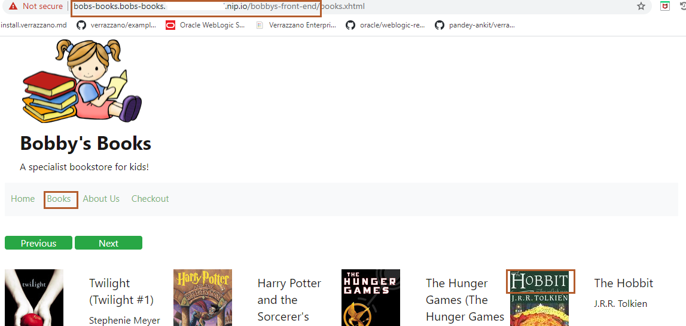
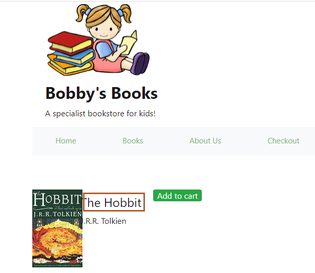
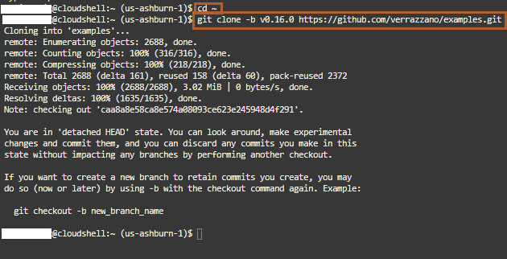
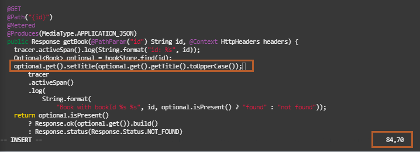
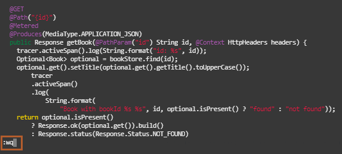

# Modify the Bob's Book Application and Create a New Application Component Image

## Introduction

In this lab, we will modify bobbys-helidon-stock-application through the *Cloud Shell*. Later, we will create a new Docker image for bobbys-helidon-stock-application. This bobbys-helidon-stock-application image is a component for the Bob's Books application.

### Objectives

In this lab, you will:

* Modify bobbys-helidon-stock-application.
* Create a new Docker image for bobbys-helidon-stock-application.

### Prerequisites

You should have a text editor, where you can paste the commands and URLs and modify them, as per your environment. Then you can copy and paste the modified commands for running them in the *Cloud Shell*.

## Task 1: Modify bobbys-helidon-stock-application

1. Select the Bob's Book tab, then click *Books*, and then click on the image for *The Hobbit* book, as shown:

    

    It shows the book name in the format *The Hobbit*, as shown in the image.

    

2. We want to convert the book name to upper case letters (THE HOBBIT). We need to download the source code for the Bob's Books application. Make sure, you are in the home folder. Copy the following commands and paste it in the *Cloud Shell*.

    ```bash
    <copy>cd ~
    git clone -b v0.16.0 https://github.com/verrazzano/examples.git</copy>
    ```

    

3. To view the files inside the Bob's Book application, copy the following command and paste it in the *Cloud Shell*.

    ```bash
    <copy>ls -la ~/examples/bobs-books/</copy>
    ```

    

4. Now, we are going to make changes in the relevant JAVA_FILE. To open the file, please copy the following command and paste it in the *Cloud Shell*.

    ```bash
    <copy>vi ~/examples/bobs-books/bobbys-books/bobbys-helidon-stock-application/src/main/java/org/books/bobby/BookResource.java</copy>
    ```

    

5. Press *i*, so that you can modify the code. To add a new line at line number 84, copy the following line and paste it at line number 84 as shown:

    ```bash
    <copy>optional.get().setTitle(optional.get().getTitle().toUpperCase());</copy>
    ```

    

6. Press *Esc* and then *:wq* to save the changes.

    

## Task 2: Create a new Docker image for the bobbys-helidon-stock-application

1. Because we are going to build a new Docker image for *bobbys-helidon-stock-application*, which has dependencies on *bobbys-coherence-application*, we run a *Maven* command to clean the existing bobbys-coherence-application archive and compile, build, package, and install a new bobby-coherence-application archive in a local Maven repository. To change to the *bobbys-coherence* directory folder and to compile, build, and install the *bobbys-coherence* application archive into a local Maven repository, copy the following command and paste it in the *Cloud Shell*.

    ```bash
    <copy>
    cd ~/examples/bobs-books/bobbys-books/bobbys-coherence/
    mvn clean install
    </copy>
    ```

    
    

2. Because we modified *bobbys-helidon-stock-application*, we need to compile, build, and package this application. To change to the *bobbys-helidon-stock-application* directory and to package *bobbys-helidon-stock-application* into a JAR file, copy the following command and paste it in the *Cloud Shell*.  In the second image, you can see the creation of the `bobbys-helidon-stock-application.jar` file at `~/examples/bobs-books/bobbys-books/bobbys-helidon-stock-application/target`.

    ```bash
    <copy>cd ~/examples/bobs-books/bobbys-books/bobbys-helidon-stock-application/
    mvn clean package
    </copy>
    ```

    
    

3. We are going to create a Docker image for bobby-stock-helidon-application, but this application uses a specific version of JDK and we don't want to change the Docker files which build the new image. So, we download the required JDK. To download the required JDK version, copy the below command and paste it in the *Cloud Shell*.

    ```bash
    <copy>wget https://download.java.net/java/GA/jdk14.0.2/205943a0976c4ed48cb16f1043c5c647/12/GPL/openjdk-14.0.2_linux-x64_bin.tar.gz</copy>
    ```

    

4. We are creating a Docker image, which we will upload to the Oracle Cloud Container Registry in Lab 6. To create the file name, we need the following information:

    * Tenancy Namespace
    * End point for the Region

    You can find out your *Region Name* in top right corner in the Oracle Cloud Console, as shown in following image.
    

5. For finding the Namespace of the tenancy, select the Hamburger Menu -> Developer Services -> Container Registry, as shown. In the compartment, you will find the Namespace. Copy and save it in somewhere in your text editor. Keep it in the text editor, because we will also use it in Lab 6.

    
    

6. To find out the endpoint for your Region, select this URL [https://docs.oracle.com/en-us/iaas/Content/Registry/Concepts/registryprerequisites.htm#Availab](https://docs.oracle.com/en-us/iaas/Content/Registry/Concepts/registryprerequisites.htm#Availab). In my case, it is *US EAST (Ashburn)* as the region name, thus its endpoint is *iad.ocir.io*. Find out your endpoint for your own *Region Name* and save it in the text editor. We will also need it for the next lab.

    

7. Now you have both the Tenancy Namespace and Endpoint for your region. Copy the following command and paste it in your text editor. Then replace the `END_POINT_OF_YOUR_REGION` with the endpoint of your region name and `NAMESPACE_OF_YOUR_TENANCY` with your tenancy's namespace.

    ```bash
    <copy>docker build --force-rm=true -f Dockerfile -t `END_POINT_OF_YOUR_REGION`/`NAMESPACE_OF_YOUR_TENANCY`/helidon-stock-application:1.0 .</copy>
    ```

    

    

This creates the Docker image, which we will push into the Oracle Cloud Container Registry repository in Lab 6. You need to copy the replaced full image name `END_POINT_OF_YOUR_REGION`/`NAMESPACE_OF_YOUR_TENANCY`/helidon-stock-application:1.0 in your text editor; we will need it in Lab 6 and Lab 7.

Leave the *Cloud Shell* open; we need it for next lab.

## Acknowledgements

* **Author** -  Ankit Pandey
* **Contributors** - Maciej Gruszka, Peter Nagy
* **Last Updated By/Date** - Kamryn Vinson, July 2021
